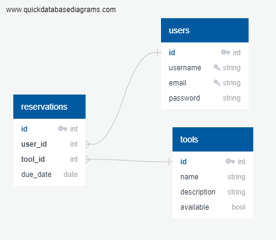

# Tool Library
A tool lending simulation.

## Overview
Tool Library will be an web application which simulates a community tool lending platform. Users will be able to reserve tools they need via a searchable online catalog, renew borrowed tools to extend due date, and report broken or damaged items.

## Goals
- Simulate a community lending application
- Present a welcoming, user-friendly interface
- Showcase well documented, thoroughly tested, and soundly engineered code as the final capstone project of the Springboard Software Engineering Course.
- Raise awareness of the awesomeness of community tool libraries

## User Demographic
The intended user demographic of this app includes anyone looking to explore the mechanics of a tool lending application via a simulation. Tool lending is useful to anyone looking to borrow a tool they need rather than purchasing one.

## Tech Stack and Data Source
This project will be built using React and Node. 

The tool database API will be built using sample data scraped from actual tool library websites. A calendar or scheduler API (yet to be sourced) will be used in the reservation process.

## Schema

## Features
- Search or browse for tools
- Reserve tools by selecting desired date
- Renew tools to extend due date
- View current and previously borrowed tools via profile
- Report broken or damaged tools

## Userflow
1. Landing Page - includes links to browse available tools, login or register user
2. Search Page - shows available tools, with options to search by name
3. Tool Detail - shows more information about a specific tool with option to reserve
4. User Profile - shows tools currently or previously checked out, shows option to renew tools to extend due date, shows option to report damaged or broken items.

## Sensitive information
Passwords will be encrypted using bcrypt. Minimal user information will be collected.

## Potential Issues
Data sourced via web scraping may require time to clean up.

## Stretch Goals
- Feature to request tools not currently carried by the library
- Refine sort and filter functionality (by type, date available, etc.)
- Suggest similar items